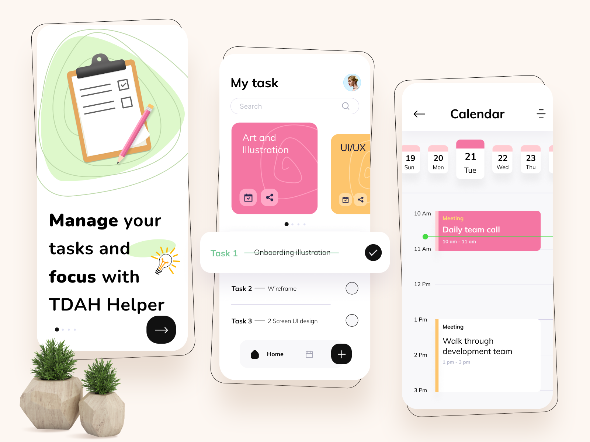

# TDAH Helper

## Preámbulo

El Trastorno por Déficit de Atención e Hiperactividad (TDAH) puede impactar significativamente la capacidad de organización, concentración y productividad en el día a día. Como una persona con TDAH, me enfrenté a la necesidad de encontrar una herramienta que me ayudara a gestionar mejor mis actividades. Esto me llevó a crear plantillas que, a través de una estructura organizada de metas y tareas, me han permitido mejorar mi productividad. Al compartir estas plantillas con amigos y mi red de apoyo, descubrí que no solo lograba sentirme menos disperso, sino que también experimentaba mejoras tangibles en mi enfoque. Este proyecto busca llevar esa experiencia a una app, integrando recordatorios, gestión de tareas y metas, y la posibilidad de compartir el progreso con amigos, para ayudar a más personas a sentirse en control de sus actividades diarias.

## Resumen del Proyecto

El objetivo de la aplicación móvil es permitir a los usuarios organizar su vida mediante la creación de áreas de enfoque, metas semanales y tareas diarias. Estas tareas pueden subdividirse en subtareas más pequeñas para facilitar la concentración en pasos manejables. Además, los usuarios podrán compartir sus estadísticas de progreso con otras personas de confianza, permitiendo un sistema de retroalimentación y apoyo que impulse el cumplimiento de los objetivos.

La aplicación será desarrollada utilizando **Expo** para crear una app móvil nativa, mientras que **Node.js** con **Prisma** y **Express** se encargará de gestionar el backend y los datos. Se implementará un sistema de autenticación seguro para los usuarios, junto con notificaciones personalizadas que les recordarán sus tareas y metas. Además, la app permitirá compartir estadísticas de progreso con otras personas, fomentando la colaboración y el apoyo mutuo. También se contempla el desarrollo de una **web app**, que funcionará como un centro de organización, ofreciendo una visión más amplia de los datos y facilitando la gestión del día a día.

## Funcionalidades Generales

1. **Gestión de Áreas, Metas y Tareas:**

   - Creación de áreas de enfoque (ej.: trabajo, salud, cuidado personal).
   - Establecimiento de metas a corto y largo plazo en cada área.
   - Creación de tareas y subtareas para desglosar las metas.
   - Visualización semanal de los objetivos y metas.

2. **Sublistas de Tareas:**

   - Posibilidad de crear subtareas para tareas más grandes, facilitando el enfoque y seguimiento del progreso diario.

3. **Recordatorios y Notificaciones:**

   - Notificaciones personalizadas para recordar a los usuarios sus tareas diarias o metas a cumplir.

4. **Compartir Estadísticas con Amigos:**

   - Posibilidad de compartir el progreso de manera automatizada o manual con otros usuarios.
   - Funcionalidad para que los amigos envíen recordatorios o mensajes motivadores.

5. **Autenticación y Seguridad:**
   - Registro y login para gestionar cuentas de usuario de manera segura, utilizando autenticación JWT.

## Consideraciones Técnicas

1. **Frontend:**

   - El frontend será desarrollado utilizando **Expo** (basado en React Native) para facilitar la creación de una aplicación móvil nativa que funcione tanto en iOS como en Android.
   - Se usará **Tailwind CSS** para diseñar una interfaz de usuario simple y adaptable.

2. **Backend:**

   - Se utilizará **Node.js** junto con **Express** para gestionar las rutas y la lógica del servidor.
   - La base de datos será manejada con **Prisma**, ofreciendo una forma sencilla y robusta de trabajar con datos relacionales.
   - **JWT (JSON Web Token)** será empleado para autenticación segura.

3. **Base de Datos:**

   - **PostgreSQL** será la base de datos recomendada para gestionar usuarios, áreas, metas y tareas.

4. **Pruebas y Seguridad:**
   - Pruebas unitarias y de integración se implementarán en el backend para garantizar la robustez del sistema.
   - Se incluirán medidas de seguridad básicas como encriptación de contraseñas y protección de rutas.

## Roadmap con Hitos y Objetivos

### Hito 1: Definición del MVP (Producto Mínimo Viable)

**Objetivo:** Definir claramente las funcionalidades básicas para la primera versión del producto.

- **Descripción:** Se definirán las áreas clave, incluyendo la creación de áreas, metas, tareas, sublistas de tareas, y la opción de compartir estadísticas. Se establecerá la lógica del backend y la estructura de las bases de datos.
- **Resultado:** Se dispondrá de un documento detallado que describa las funcionalidades mínimas necesarias para el lanzamiento.

### Hito 2: Configuración del entorno

**Objetivo:** Establecer las bases técnicas del proyecto, tanto en el frontend como en el backend.

- **Descripción:**
  - Se configurará **Expo** para el desarrollo de la app móvil.
  - Se configurará el backend utilizando **Node.js**, **Express**, y **Prisma**.
  - Se implementará una base de datos inicial con Prisma para gestionar usuarios, áreas, metas y tareas.
- **Resultado:** El proyecto contará con una estructura básica establecida y con una conexión funcional entre el frontend y el backend.

### Hito 3: Crear la estructura básica de usuarios

**Objetivo:** Implementar un sistema de autenticación y gestión de usuarios.

- **Descripción:**
  - Se implementará el registro y login con validaciones.
  - Se integrará **JWT** para la autenticación segura de los usuarios.
  - Se crearán las rutas de API necesarias para gestionar el registro y autenticación de los usuarios.
- **Resultado:** Los usuarios podrán registrarse, iniciar sesión de forma segura y mantener sus sesiones activas.

### Hito 4: Gestión de áreas, metas y tareas

**Objetivo:** Implementar la funcionalidad para que los usuarios puedan gestionar sus áreas de enfoque, metas y tareas.

- **Descripción:**
  - Se permitirá a los usuarios definir **áreas** y asociarlas a **metas** específicas.
  - Se implementará la funcionalidad para crear **tareas** y desglosarlas en **subtareas**.
  - Se actualizará la base de datos para almacenar la información de áreas, metas, tareas y subtareas.
- **Resultado:** Los usuarios podrán organizar su vida a través de áreas, metas y tareas, y tendrán la capacidad de desglosar sus objetivos en pasos más manejables.

### Hito 5: Recordatorios y notificaciones

**Objetivo:** Añadir funcionalidades para que los usuarios reciban recordatorios automáticos sobre sus tareas y metas.

- **Descripción:**
  - Se configurarán notificaciones locales o push a través de **Expo** para recordar a los usuarios sus tareas diarias.
  - Se implementará un sistema de recordatorios automáticos para las metas semanales establecidas por los usuarios.
- **Resultado:** De esta manera, los usuarios recibirán recordatorios que les ayudarán a mantenerse enfocados en las tareas más importantes y a no perder de vista sus metas.

### Hito 6: Compartir estadísticas y progreso

**Objetivo:** Implementar la opción de compartir el progreso personal con otras personas, ya sea de forma automática o manual.

- **Descripción:**
  - Se creará una funcionalidad para que los usuarios puedan compartir su progreso (estadísticas generales o información específica) con otras personas.
  - Se implementará un **dashboard** para que quienes reciban el progreso puedan visualizarlo, con la posibilidad de enviar recordatorios o mensajes motivacionales.
- **Resultado:** Los usuarios podrán compartir su progreso con amigos o compañeros de apoyo, fomentando la motivación y la responsabilidad compartida para mejorar la productividad.

### Hito 7: Diseño UI/UX y optimización

**Objetivo:** Mejorar la experiencia del usuario, optimizar el rendimiento y hacer la interfaz más atractiva y funcional.

- **Descripción:**
  - Se refinará el diseño de la interfaz de usuario, priorizando la simplicidad y la claridad visual.
  - Se optimizarán las transiciones y las interacciones para que la experiencia de usuario sea rápida y fluida.
  - Se realizarán pruebas de usabilidad con usuarios reales para ajustar el diseño según el feedback recibido.
- **Resultado:** El objetivo es que sea fácil de usar, ágil y visualmente atractiva, brindando a los usuarios una experiencia fluida y agradable.

### Hito 8: Pruebas y lanzamiento de la versión beta

**Objetivo:** Realizar pruebas exhaustivas de la aplicación en múltiples dispositivos y lanzar una versión beta para obtener retroalimentación.

- **Descripción:**
  - Se llevarán a cabo pruebas exhaustivas para detectar errores y asegurar que la aplicación funcione correctamente en diferentes dispositivos.
  - Se implementarán correcciones de bugs y optimizaciones basadas en el feedback de las pruebas.
  - Se lanzará una versión beta controlada para usuarios seleccionados, permitiendo obtener más retroalimentación antes del lanzamiento oficial.
- **Resultado:** La aplicación será probada por usuarios reales, quienes proporcionarán retroalimentación valiosa para realizar ajustes finales y asegurar que el producto final cumpla con las expectativas.

## Colaboración

Si tienes ideas o sugerencias, no dudes en utilizar el apartado de **[issues](https://github.com/jmontes50/tdah-helper/issues)** para hacerme llegar tus propuestas. Este proyecto también está abierto a **pull requests** (PR), así que siéntete libre de hacer un **fork** y contribuir con mejoras o nuevas funcionalidades.

Para cualquier otra consulta o duda, puedes mandarme un [email](mailto:osmarmontes50@gmail.com)  o escribirme por [LinkedIn](https://www.linkedin.com/in/osmarmontesinos/).
